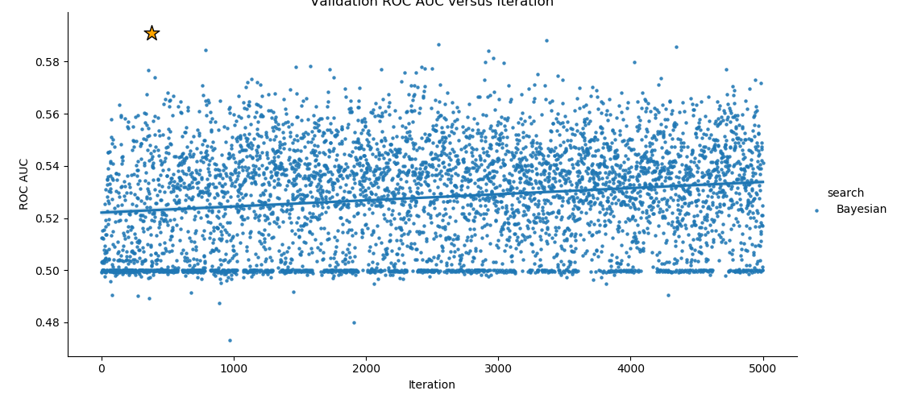

NSQIP_pituitary
==============================

Predictive algorithms for NSQIP pituitary tumors

Project Organization
------------

    ├── LICENSE
    ├── Makefile           <- Makefile with commands like `make data` or `make train`
    ├── README.md          <- The top-level README for developers using this project.
    ├── data
    │   ├── external       <- Data from third party sources.
    │   ├── interim        <- Intermediate data that has been transformed.
    │   ├── processed      <- The final, canonical data sets for modeling.
    │   └── raw            <- The original, immutable data dump.
    │
    ├── docs               <- A default Sphinx project; see sphinx-doc.org for details
    │
    ├── models             <- Trained and serialized models, model predictions, or model summaries
    │
    ├── notebooks          <- Jupyter notebooks. Naming convention is a number (for ordering),
    │                         the creator's initials, and a short `-` delimited description, e.g.
    │                         `1.0-jqp-initial-data-exploration`.
    │
    ├── references         <- Data dictionaries, manuals, and all other explanatory materials.
    │
    ├── reports            <- Generated analysis as HTML, PDF, LaTeX, etc.
    │   └── figures        <- Generated graphics and figures to be used in reporting
    │
    ├── requirements.txt   <- The requirements file for reproducing the analysis environment, e.g.
    │                         generated with `pip freeze > requirements.txt`
    │
    ├── setup.py           <- makes project pip installable (pip install -e .) so src can be imported
    ├── src                <- Source code for use in this project.
    │   ├── __init__.py    <- Makes src a Python module
    │   │
    │   ├── data           <- Scripts to download or generate data
    │   │   └── make_dataset.py
    │   │
    │   ├── features       <- Scripts to turn raw data into features for modeling
    │   │   └── build_features.py
    │   │
    │   ├── models         <- Scripts to train models and then use trained models to make
    │   │   │                 predictions
    │   │   ├── predict_model.py
    │   │   └── train_model.py
    │   │
    │   └── visualization  <- Scripts to create exploratory and results oriented visualizations
    │       └── visualize.py
    │
    └── tox.ini            <- tox file with settings for running tox; see tox.testrun.org

--------

<small>Project based on the <a target="_blank" href="https://drivendata.github.io/cookiecutter-data-science/">cookiecutter data science project template</a>. #cookiecutterdatascience</small>

## Getting Started

### Installing necessary packages

All of the necessary python packages can be installed using either conda or pip. To install necessary packages with pip, enter the following in the command line:

`> pip3 install -r requirements.txt` (Python 3)

To install the necessary packages using Conda, use the following commands to create a Conda virtual environment with all of the necessary packages:

`> conda env create -f environment.yml`

The environment will be name NSQIP, and you can activate it by typing:

`> conda activate NSQIP`

### Generating Clean Dataset

After all of the necessary packages are installed, we can generate a cleaned dataset from the raw data. Options for this process can be found in src/dataset_options.py. Using this file or the command line, you can select which features you would like to include in the cleaned dataset (e.g., AGE, SEX, WTLOSS, etc). You can also select how to handle missing values, how to normalize continuous variables, and the size of the testing dataset. From the main project directory, run the following:

`nsqip_pituitary>python src/data/make_dataset.py --input_file data/raw/<insert filename>`

To see a complete list of available options, run:

`nsqip_pituitary>python src/data/make_dataset.py --help`

By default, a complete dataset will be generated in data/processed/NSQIP_processed.csv. Furthermore, datasets containing the training features, training labels, testing features, and testing labels will be saved in data/split/ as follows:

    ├── data
        │   ├── external       <- Data from third party sources.
        │   ├── interim        <- Intermediate data that has been transformed.
        │   ├── processed      <- The final, canonical data sets for modeling.
        │   ├── raw            <- The original, immutable data dump.
        |   └── split
                  ├── test_features.csv
                  ├── test_labels.csv
                  ├── train_features.csv
                  └── train_labels.csv
             
### Running Bayesian Parameter Optimization

Now that the datasets have been created, we can tune the parameters of any SKLearn algorithm (such as SVC, MLP, XGBoost, RandomForest, DecisionTree, etc) using src/models/optimization.py. All options for this script can be found in src/options/optimization_options.py and can be changed via the command line or directly in the file.
To run the optimization for the Suppert Vector Classifier (SVC) for 1000 iterations, enter:

`nsqip_pituitary>python src/models/optimization.py --model SVC --max_evals 1000`

The output will look something like the following:

    ----------------- Options ---------------
              checkpoints_dir: ./checkpoints
                 continue_opt: 0
                 dataset_path: data/split/
                      gpu_ids: -1
                    max_evals: 10                                   [default: 5000]
                       metric: balanced_accuracy_score
                        model: SVC
                      n_folds: 5
                         name: experiment_name
                  num_threads: 4
                      outfile: reports/optimization/2020-07-20_bayes_test.csv
    ----------------- End -------------------
    100%|███████████████████████████████████████████████| 10/10 [00:18<00:00,  1.81s/trial, best loss: 0.40362455962455956]
    The highest cross validation score from Bayesian was 0.59638 found on iteration 3.
    Optimal Hyperparameters: {'C': 5.554313452624174, 'class_weight': 'balanced', 'kernel': 'linear', 'tol': 0.0023771944076088633}
    ROC AUC from Bayesian on test data = 0.73037.
    Optimization Complete

This script will record each trial and save all results to reports/optimization/ by default. The optimization can be continued for additional tuning if desired using the --continue_opt = 1 command line flag. 

Multiple algorithms can be optimized sequentially using the file src/models/optimize_multiple.py. The algorithms to optimize are specified at the start of this script and can be edited manually. 

### Visualizing Optimization Results

The results of the Bayesian parameter optimization can be visualized using the script src/visualization/visualize_optimization.py. This scrip will plot the value of each parameter optimized per iteration so you can see how it changes over time. To visualize our SVC optimization from the previous step, enter:

`nsqip_pituitary>python src/visualization/visualize_optimization.py --results reports/optimization/<enter today's date in YYYY-MM-DD format>_bayes_test.csv`

An example from the optimization of a multi-layered perceptron (MLP) can be seen below:

### ROC AUC Curve Comparison (python scripts in progress)

A comparison of the ROC curves, with AUC scores, for each optimized algorithm can currently be accomplished using the 2.6-BTC-roc_auc_curves.ipynb Jupyter notebook. The results from this notebook, for algorithms that have currently been optimized can be seen below. Confidence intervals for the AUC scores are calculated via bootstrapping. 

Currently, the best performance was achieved by the SVC and Random Forest algorithms. Additional performance metrics for these algorithms are shown below:

    SVC(C=0.13869718045614998, break_ties=False, cache_size=200,
        class_weight='balanced', coef0=0.0, decision_function_shape='ovr', degree=3,
        gamma='scale', kernel='linear', max_iter=-1, probability=True,
        random_state=None, shrinking=True, tol=0.003993171050079279, verbose=False)
                  precision    recall  f1-score   support

               0       0.95      0.80      0.87       270
               1       0.26      0.63      0.37        30

        accuracy                           0.78       300
       macro avg       0.61      0.72      0.62       300
    weighted avg       0.88      0.78      0.82       300

    216, 54, 11, 19

    Sensitivity: 0.6333333333333333
    Specificity: 0.8
    PPV: 0.2602739726027397
    NPV: 0.9515418502202643
    
    RandomForestClassifier(bootstrap=True, ccp_alpha=0.0,
                       class_weight='balanced_subsample', criterion='gini',
                       max_depth=None, max_features='log2', max_leaf_nodes=None,
                       max_samples=None,
                       min_impurity_decrease=0.008135280338330211,
                       min_impurity_split=None, min_samples_leaf=6,
                       min_samples_split=6,
                       min_weight_fraction_leaf=0.04357678838454903,
                       n_estimators=253, n_jobs=8, oob_score=False,
                       random_state=0, verbose=0, warm_start=False)
              precision    recall  f1-score   support

           0       0.93      0.87      0.90       270
           1       0.25      0.40      0.31        30

    accuracy                           0.82       300
    macro avg       0.59      0.63      0.60       300
    weighted avg       0.86      0.82      0.84       300

    234, 36, 18, 12

    Sensitivity: 0.4
    Specificity: 0.8666666666666667
    PPV: 0.25
    NPV: 0.9285714285714286

### Permutation Feature Analysis (python scripts in progress)

A permutation analysis to identify the most important features can be accomplished using the 2.5-BTC-permutations.ipynb Jupyter notebook. Shown below is the complete permutation analysis for currently included variables, from most to least important. Negative values indicate high feature importance. Positive values may indicate that the inclusion of this feature is actually hurting algorithm performance. 

    RETURNOR_Yes                                             -0.384822
    PRSODM                                                   -0.281458
    BMI                                                      -0.134625
    PRPTT                                                    -0.134017
    TOTHLOS                                                  -0.128810
    PRBUN                                                    -0.096114
    PRCREAT                                                  -0.087605
    PRPLATE                                                  -0.082976
    OPTIME                                                   -0.063349
    AGE                                                      -0.037792
    PRALBUM                                                  -0.037310
    PRINR                                                    -0.030967
    RACE_NEW_White                                           -0.026444
    ASACLAS_3_Severe_Disturb                                 -0.023277
    HYPERMED_Yes                                             -0.020323
    SEX_male                                                 -0.019657
    ASACLAS_2_Mild_Disturb                                   -0.018632
    SMOKE_Yes                                                -0.018173
    RACE_NEW_Black_or_African_American                       -0.016183
    DISCHDEST_Home                                           -0.012090
    PRPT                                                     -0.010284
    STEROID_Yes                                              -0.009741
    DIABETES_NON_INSULIN                                     -0.007751
    BLEEDIS_No                                               -0.006718
    DISCHDEST_Unknown                                        -0.006274
    WTLOSS_Yes                                               -0.005823
    BLEEDIS_Unknown                                          -0.005578
    RACE_NEW_Unknown_Not_Reported                            -0.004966
    DYSPNEA_No                                               -0.004713
    ASACLAS_Unknown                                          -0.003581
    ASACLAS_None_assigned                                    -0.003390
    ETHNICITY_HISPANIC_N                                     -0.003153
    ETHNICITY_HISPANIC_U                                     -0.002885
    DIABETES_NO                                              -0.002288
    ASACLAS_1_No_Disturb                                     -0.002257
    DYSPNEA_MODERATE_EXERTION                                -0.001813
    DIABETES_INSULIN                                         -0.001385
    RACE_NEW_American_Indian_or_Alaska_Native                -0.001377
    TRANST_Not_transferred__admitted_from_home_              -0.001377
    TRANST_Transfer_from_other                               -0.000819
    TRANST_Outside_emergency_department                      -0.000773
    BLEEDIS_Yes                                              -0.000742
    EMERGNCY_Yes                                             -0.000620
    PRSEPIS_None                                             -0.000566
    DISCHDEST_Rehab                                          -0.000214
    RACE_NEW_Native_Hawaiian_or_Pacific_Islander             -0.000145
    DYSPNEA_AT_REST                                          -0.000061
    TRANST_Unknown                                           -0.000046
    PRSEPIS_Sepsis                                           -0.000015
    DISCANCR_Yes                                             -0.000008
    WNDINF_Yes                                                0.000000
    TRANST_From_acute_care_hospital_inpatient                 0.000145
    ASACLAS_4_Life_Threat                                     0.000344
    PRSEPIS_SIRS                                              0.000413
    HXCOPD_Yes                                                0.000543
    ETHNICITY_HISPANIC_Y                                      0.000765
    TRANST_Nursing_home___Chronic_care___Intermediate_care    0.001553
    DISCHDEST_Skilled_Care__Not_Home                          0.003543
    RACE_NEW_Asian                                            0.004813
