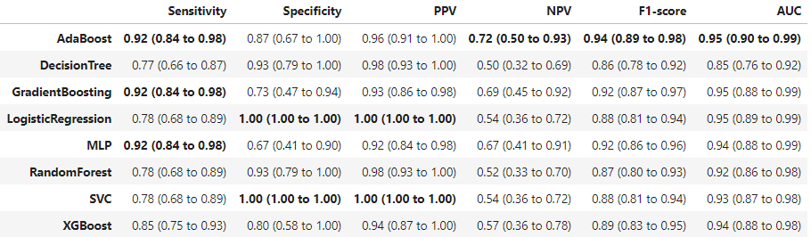
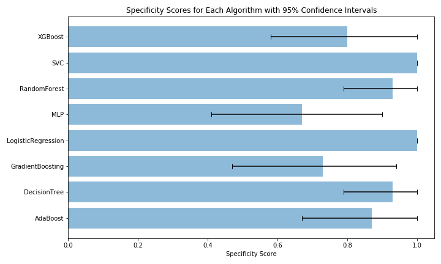
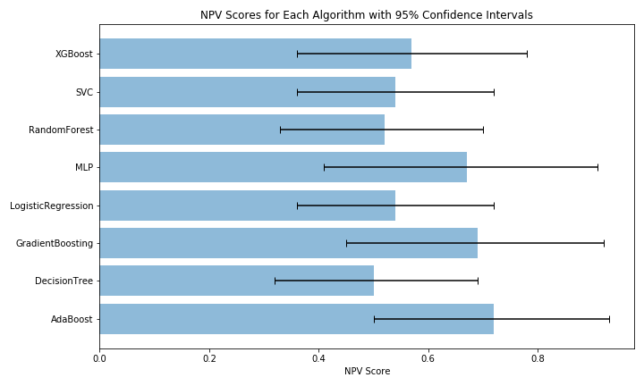
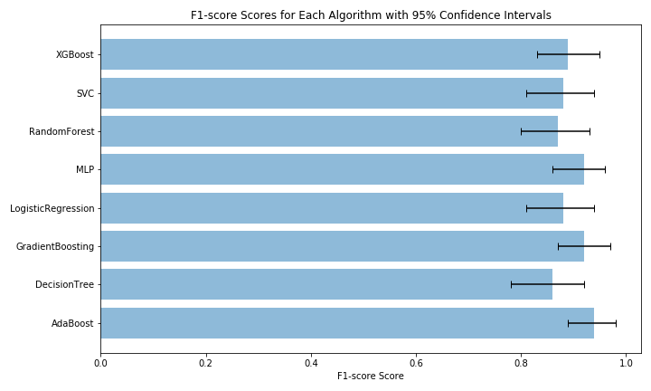
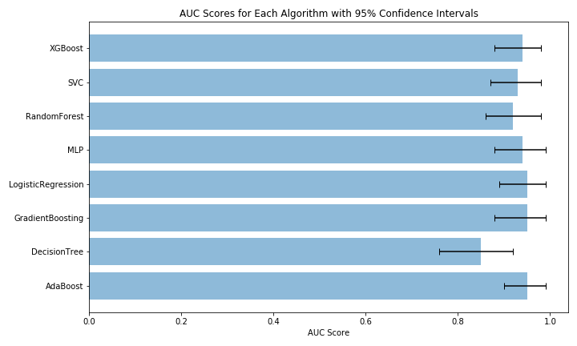
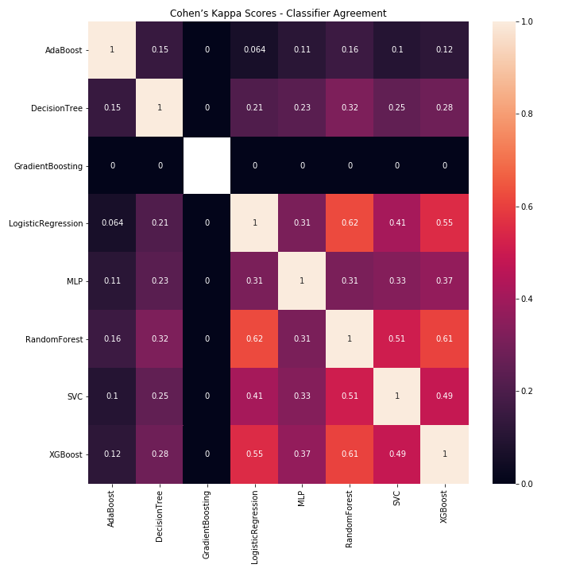

NSQIP_pituitary
==============================

Predictive algorithms for NSQIP pituitary tumors

Project Organization
------------

    ├── LICENSE
    ├── Makefile           <- Makefile with commands like `make data` or `make train`
    ├── README.md          <- The top-level README for developers using this project.
    ├── data
    │   ├── external       <- Data from third party sources.
    │   ├── interim        <- Intermediate data that has been transformed.
    │   ├── processed      <- The final, canonical data sets for modeling.
    │   └── raw            <- The original, immutable data dump.
    │
    ├── docs               <- A default Sphinx project; see sphinx-doc.org for details
    │
    ├── models             <- Trained and serialized models, model predictions, or model summaries
    │
    ├── notebooks          <- Jupyter notebooks. Naming convention is a number (for ordering),
    │                         the creator's initials, and a short `-` delimited description, e.g.
    │                         `1.0-jqp-initial-data-exploration`.
    │
    ├── references         <- Data dictionaries, manuals, and all other explanatory materials.
    │
    ├── reports            <- Generated analysis as HTML, PDF, LaTeX, etc.
    │   └── figures        <- Generated graphics and figures to be used in reporting
    │
    ├── requirements.txt   <- The requirements file for reproducing the analysis environment, e.g.
    │                         generated with `pip freeze > requirements.txt`
    │
    ├── setup.py           <- makes project pip installable (pip install -e .) so src can be imported
    ├── src                <- Source code for use in this project.
    │   ├── __init__.py    <- Makes src a Python module
    │   │
    │   ├── data           <- Scripts to download or generate data
    │   │   └── make_dataset.py
    │   │
    │   ├── features       <- Scripts to turn raw data into features for modeling
    │   │   └── build_features.py
    │   │
    │   ├── models         <- Scripts to train models and then use trained models to make
    │   │   │                 predictions
    │   │   ├── predict_model.py
    │   │   └── train_model.py
    │   │
    │   └── visualization  <- Scripts to create exploratory and results oriented visualizations
    │       └── visualize.py
    │
    └── tox.ini            <- tox file with settings for running tox; see tox.testrun.org

--------

<small>Project based on the <a target="_blank" href="https://drivendata.github.io/cookiecutter-data-science/">cookiecutter data science project template</a>. #cookiecutterdatascience</small>

## Getting Started
### Cloning the Repository
To download the repository, enter the following in the command line prompt:

`> git clone https://github.com/btcrabb/nsqip_pituitary`

`> cd nsqip_pituitary`

Alternatively, you can download the repository as a zip file directly from the webpage. For secuirity reasons, the raw dataset is not included in the github repository. Make a new directory called /data/raw, as shown in the project outline above and below and copy the dataset (in .csv or .xlsx format) into this folder.

    ├── data                                <- Create new data folder.
           └── raw                          <- Create new data/raw folder.
                 └── dataset.csv            <- Save the dataset here in .csv format.

### Installing necessary packages

All of the necessary python packages can be installed using either conda or pip. To install necessary packages with pip, enter the following in the command line:

`> pip3 install -r requirements.txt` (Python 3)

To install the necessary packages using Conda, use the following commands to create a Conda virtual environment with all of the necessary packages:

`> conda env create -f environment.yml`

The environment will be name NSQIP, and you can activate it by typing:

`> conda activate NSQIP`

### Generating Clean Dataset

After all of the necessary packages are installed, we can generate a cleaned dataset from the raw data. Options for this process can be found in src/dataset_options.py. Using this file or the command line, you can select which features you would like to include in the cleaned dataset (e.g., AGE, SEX, WTLOSS, etc). You can also select how to handle missing values, how to normalize continuous variables, and the size of the testing dataset. From the main project directory, run the following:

`nsqip_pituitary>python src/data/make_dataset.py --input_file data/raw/<insert filename>`

To see a complete list of available options, run:

`nsqip_pituitary>python src/data/make_dataset.py --help`

By default, a complete dataset will be generated in data/processed/NSQIP_processed.csv. Furthermore, datasets containing the training features, training labels, testing features, and testing labels will be saved in data/split/ as follows:

    ├── data
        │   ├── external       <- Data from third party sources.
        │   ├── interim        <- Intermediate data that has been transformed.
        │   ├── processed      <- The final, canonical data sets for modeling.
        │   ├── raw            <- The original, immutable data dump.
        |   └── split          <- The dataset split into training and testing datasets.
                |    ├── test_features.csv
                |    ├── test_labels.csv
                |    ├── train_features.csv
                |    └── train_labels.csv
             
### Running Bayesian Parameter Optimization

Now that the datasets have been created, we can tune the parameters of any SKLearn algorithm (such as SVC, MLP, XGBoost, RandomForest, DecisionTree, etc) using src/models/optimization.py. All options for this script can be found in src/options/optimization_options.py and can be changed via the command line or directly in the file.
To run the optimization for the Suppert Vector Classifier (SVC) for 1000 iterations, enter:

`nsqip_pituitary>python src/models/optimization.py --model SVC --max_evals 1000`

The output will look something like the following:

    ----------------- Options ---------------
              checkpoints_dir: ./checkpoints
                 continue_opt: 0
                 dataset_path: data/split/
                      gpu_ids: -1
                    max_evals: 10                                   [default: 5000]
                       metric: balanced_accuracy_score
                        model: SVC
                      n_folds: 5
                         name: experiment_name
                  num_threads: 4
                      outfile: reports/optimization/2020-07-20_bayes_test.csv
    ----------------- End -------------------
    100%|███████████████████████████████████████████████| 10/10 [00:18<00:00,  1.81s/trial, best loss: 0.40362455962455956]
    The highest cross validation score from Bayesian was 0.59638 found on iteration 3.
    Optimal Hyperparameters: {'C': 5.554313452624174, 'class_weight': 'balanced', 'kernel': 'linear', 'tol': 0.0023771944076088633}
    ROC AUC from Bayesian on test data = 0.73037.
    Optimization Complete

This script will record each trial and save all results to reports/optimization/ by default. The optimization can be continued for additional tuning if desired using the --continue_opt = 1 command line flag. 

Multiple algorithms can be optimized sequentially using the file src/models/optimize_multiple.py. The algorithms to optimize are specified at the start of this script and can be edited manually. 

### Visualizing Optimization Results

The results of the Bayesian parameter optimization can be visualized using the script src/visualization/visualize_optimization.py. This scrip will plot the value of each parameter optimized per iteration so you can see how it changes over time. To visualize our SVC optimization from the previous step, enter:

`nsqip_pituitary>python src/visualization/visualize_optimization.py --results reports/optimization/<enter today's date in YYYY-MM-DD format>_bayes_test.csv`

An example from the optimization of a multi-layered perceptron (MLP) can be seen below:

### ROC AUC Curve Comparison 

A comparison of the ROC curves, with AUC scores, for each optimized algorithm can currently be accomplished using the src/visualization/roc_auc_curves.py python script. To run this script, enter the following in the command line:

`nsqip_pituitary>python src/visualization/roc_auc_curves.py`

The results from this script, for algorithms that have currently been optimized can be seen below. Confidence intervals for the AUC scores are calculated via bootstrapping. 

Additional performance metrics for these algorithms are shown below:

    AdaBoostClassifier(algorithm='SAMME', base_estimator=None,
                   learning_rate=1.4171468839560952, n_estimators=43,
                   random_state=0)
                  precision    recall  f1-score   support

               0       0.72      0.87      0.79        15
               1       0.96      0.92      0.94        60

        accuracy                           0.91        75
       macro avg       0.84      0.89      0.86        75
    weighted avg       0.92      0.91      0.91        75

    Confusion Matrix:
    Predicted   0   1
    Actual           
    0          13   2
    1           5  55

    Sensitivity: 0.9166666666666666
    Specificity: 0.8666666666666667
    PPV: 0.9649122807017544
    NPV: 0.7222222222222222

    GradientBoostingClassifier(ccp_alpha=0.0, criterion='mae', init=None,
                               learning_rate=2.185471712937021, loss='exponential',
                               max_depth=21, max_features=None, max_leaf_nodes=None,
                               min_impurity_decrease=0.010576807442075523,
                               min_impurity_split=None, min_samples_leaf=9,
                               min_samples_split=5,
                               min_weight_fraction_leaf=0.008934718614468866,
                               n_estimators=243, n_iter_no_change=None,
                               presort='deprecated', random_state=0,
                               subsample=0.5360294592086643, tol=0.0001,
                               validation_fraction=0.1, verbose=0,
                               warm_start=False)
                  precision    recall  f1-score   support

               0       0.69      0.73      0.71        15
               1       0.93      0.92      0.92        60

        accuracy                           0.88        75
       macro avg       0.81      0.82      0.82        75
    weighted avg       0.88      0.88      0.88        75

    Confusion Matrix:
    Predicted   0   1
    Actual           
    0          11   4
    1           5  55

    Sensitivity: 0.9166666666666666
    Specificity: 0.7333333333333333
    PPV: 0.9322033898305084
    NPV: 0.6875

    LogisticRegression(C=0.9887706433683173, class_weight='balanced', dual=False,
                       fit_intercept=True, intercept_scaling=1, l1_ratio=None,
                       max_iter=533, multi_class='ovr', n_jobs=8, penalty='l1',
                       random_state=0, solver='liblinear', tol=0.09016392391873748,
                       verbose=0, warm_start=False)
                  precision    recall  f1-score   support

               0       0.54      1.00      0.70        15
               1       1.00      0.78      0.88        60

        accuracy                           0.83        75
       macro avg       0.77      0.89      0.79        75
    weighted avg       0.91      0.83      0.84        75

    Confusion Matrix:
    Predicted   0   1
    Actual           
    0          15   0
    1          13  47

    Sensitivity: 0.7833333333333333
    Specificity: 1.0
    PPV: 1.0
    NPV: 0.5357142857142857

    MLPClassifier(activation='tanh', alpha=0.0002830903013805367, batch_size=51,
                  beta_1=0.7718083501222732, beta_2=0.9092746239556415,
                  early_stopping=True, epsilon=1e-08, hidden_layer_sizes=(48,),
                  learning_rate='constant', learning_rate_init=0.07020711995798333,
                  max_fun=15000, max_iter=226, momentum=0.728900952648213,
                  n_iter_no_change=10, nesterovs_momentum=True,
                  power_t=0.6545765152044052, random_state=None, shuffle=True,
                  solver='adam', tol=0.00838513832253034, validation_fraction=0.1,
                  verbose=False, warm_start=False)
                  precision    recall  f1-score   support

               0       0.67      0.67      0.67        15
               1       0.92      0.92      0.92        60

        accuracy                           0.87        75
       macro avg       0.79      0.79      0.79        75
    weighted avg       0.87      0.87      0.87        75

    Confusion Matrix:
    Predicted   0   1
    Actual           
    0          10   5
    1           5  55

    Sensitivity: 0.9166666666666666
    Specificity: 0.6666666666666666
    PPV: 0.9166666666666666
    NPV: 0.6666666666666666

    RandomForestClassifier(bootstrap=True, ccp_alpha=0.0, class_weight='balanced',
                           criterion='gini', max_depth=None, max_features='auto',
                           max_leaf_nodes=None, max_samples=None,
                           min_impurity_decrease=0.012715230600966963,
                           min_impurity_split=None, min_samples_leaf=8,
                           min_samples_split=8,
                           min_weight_fraction_leaf=0.04291472632075911,
                           n_estimators=54, n_jobs=8, oob_score=False,
                           random_state=0, verbose=0, warm_start=False)
                  precision    recall  f1-score   support

               0       0.52      0.93      0.67        15
               1       0.98      0.78      0.87        60

        accuracy                           0.81        75
       macro avg       0.75      0.86      0.77        75
    weighted avg       0.89      0.81      0.83        75

    Confusion Matrix:
    Predicted   0   1
    Actual           
    0          14   1
    1          13  47

    Sensitivity: 0.7833333333333333
    Specificity: 0.9333333333333333
    PPV: 0.9791666666666666
    NPV: 0.5185185185185185

    SVC(C=8.109111614751674, break_ties=False, cache_size=200,
        class_weight='balanced', coef0=0.0, decision_function_shape='ovr', degree=3,
        gamma='auto', kernel='rbf', max_iter=-1, probability=True,
        random_state=None, shrinking=True, tol=0.007956619548009624, verbose=False)
                  precision    recall  f1-score   support

               0       0.54      1.00      0.70        15
               1       1.00      0.78      0.88        60

        accuracy                           0.83        75
       macro avg       0.77      0.89      0.79        75
    weighted avg       0.91      0.83      0.84        75

    Confusion Matrix:
    Predicted   0   1
    Actual           
    0          15   0
    1          13  47

    Sensitivity: 0.7833333333333333
    Specificity: 1.0
    PPV: 1.0
    NPV: 0.5357142857142857

    XGBClassifier(base_score=0.5, booster='gbtree', colsample_bylevel=1,
                  colsample_bynode=1, colsample_bytree=0.7415405030267324,
                  gamma=2.2042208943656285, gpu_id=-1, importance_type='gain',
                  interaction_constraints='', learning_rate=0.450598949209009,
                  max_delta_step=0, max_depth=7, min_child_weight=3.547426392618232,
                  missing=nan, monotone_constraints='()', n_estimators=159,
                  n_jobs=0, num_parallel_tree=1, objective='binary:logistic',
                  random_state=0, reg_alpha=0, reg_lambda=1,
                  scale_pos_weight=1.0319233570783595, subsample=0.8240281755141652,
                  tree_method='exact', validate_parameters=1, verbosity=None)
                  precision    recall  f1-score   support

               0       0.57      0.80      0.67        15
               1       0.94      0.85      0.89        60

        accuracy                           0.84        75
       macro avg       0.76      0.82      0.78        75
    weighted avg       0.87      0.84      0.85        75

    Confusion Matrix:
    Predicted   0   1
    Actual           
    0          12   3
    1           9  51

    Sensitivity: 0.85
    Specificity: 0.8
    PPV: 0.9444444444444444
    NPV: 0.5714285714285714

### Performance Characteristics Comparison (python scripts in progress)

The 2.6-BTC-roc_auc_curves.ipynb Jupyter notebook can be used to produce a table of results, with and without bootstrapped confidence intervals, to compare each optimized algorithm. These tables are shown below:

### Bar Graphs with Confidence Intervals (python scripts in progress)

For each performance characteristic, a bar graph can be generated showing the relative performance of each algorithm using the 2.6-BTC-roc_auc_curves.ipynb Jupyter notebook. A few examples are shown below:

Sensitivity                |  Specificity               
:-------------------------:|:-------------------------: 
   |      

PPV                         |    NPV
:-------------------------: | :-------------------------:
 | 

F1 Score                    |    ROC Curve AUC
:-------------------------: | :-------------------------:
 | 

### Cohen's Kappa Scores for Classifier Agreement

The Jupyter notebook 2.6-BTC-roc_auc_curves.ipynb can also produce a crosstab visualization of the Cohen's Kappa coefficients for all of the classifiers. Cohen's kappa coefficient (κ) is a statistic that is used to measure inter-rater reliability for categorical items. Some fairly arbitrary guidelines in the literature identify kappas over 0.75 as excellent, 0.40 to 0.75 as fair to good, and below 0.40 as poor [Fleiss, J.L. (1981). Statistical methods for rates and proportions (2nd ed.). New York: John Wiley]. Below we see that both the linear models (SVC with linear kernel and Logistic Regression) have a high inter-rater reliability, indicating that they are producing similar predictions and likely have a similar decision boundary. 

### Permutation Feature Analysis (python scripts in progress)

A permutation analysis to identify the most important features can be accomplished using the 2.5-BTC-permutations.ipynb Jupyter notebook. Shown below is the complete permutation analysis for currently included variables, from most to least important. Negative values indicate high feature importance. Positive values may indicate that the inclusion of this feature is actually hurting algorithm performance. 

