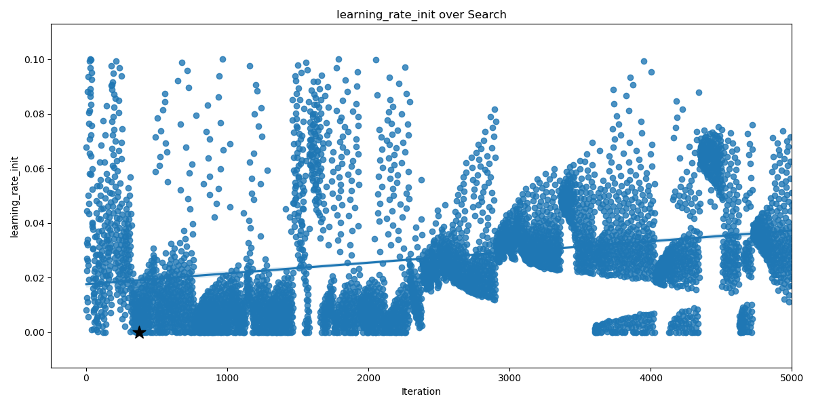
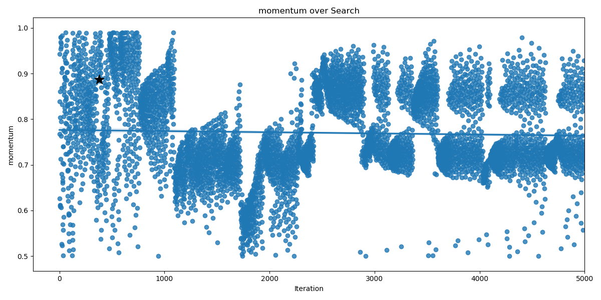

NSQIP_pituitary
==============================

Predictive algorithms for NSQIP pituitary tumors

Project Organization
------------

    ├── LICENSE
    ├── Makefile           <- Makefile with commands like `make data` or `make train`
    ├── README.md          <- The top-level README for developers using this project.
    ├── data
    │   ├── external       <- Data from third party sources.
    │   ├── interim        <- Intermediate data that has been transformed.
    │   ├── processed      <- The final, canonical data sets for modeling.
    │   └── raw            <- The original, immutable data dump.
    │
    ├── docs               <- A default Sphinx project; see sphinx-doc.org for details
    │
    ├── models             <- Trained and serialized models, model predictions, or model summaries
    │
    ├── notebooks          <- Jupyter notebooks. Naming convention is a number (for ordering),
    │                         the creator's initials, and a short `-` delimited description, e.g.
    │                         `1.0-jqp-initial-data-exploration`.
    │
    ├── references         <- Data dictionaries, manuals, and all other explanatory materials.
    │
    ├── reports            <- Generated analysis as HTML, PDF, LaTeX, etc.
    │   └── figures        <- Generated graphics and figures to be used in reporting
    │
    ├── requirements.txt   <- The requirements file for reproducing the analysis environment, e.g.
    │                         generated with `pip freeze > requirements.txt`
    │
    ├── setup.py           <- makes project pip installable (pip install -e .) so src can be imported
    ├── src                <- Source code for use in this project.
    │   ├── __init__.py    <- Makes src a Python module
    │   │
    │   ├── data           <- Scripts to download or generate data
    │   │   └── make_dataset.py
    │   │
    │   ├── features       <- Scripts to turn raw data into features for modeling
    │   │   └── build_features.py
    │   │
    │   ├── models         <- Scripts to train models and then use trained models to make
    │   │   │                 predictions
    │   │   ├── predict_model.py
    │   │   └── train_model.py
    │   │
    │   └── visualization  <- Scripts to create exploratory and results oriented visualizations
    │       └── visualize.py
    │
    └── tox.ini            <- tox file with settings for running tox; see tox.testrun.org

--------

<small>Project based on the <a target="_blank" href="https://drivendata.github.io/cookiecutter-data-science/">cookiecutter data science project template</a>. #cookiecutterdatascience</small>

## Getting Started

### Installing necessary packages

All of the necessary python packages can be installed using either conda or pip. To install necessary packages with pip, enter the following in the command line:

`> pip install -r requirements.txt` (Python 2) OR `> pip3 install -r requirements.txt` (Python 3)

To install the necessary packages using Conda, use the following commands to create a Conda virtual environment with all of the necessary packages:

`> conda env create -f environment.yml`

The environment will be name NSQIP, and you can activate it by typing:

`> conda activate NSQIP`

### Generating Clean Dataset

After all of the necessary packages are installed, we can generate a cleaned dataset from the raw data. Options for this process can be found in src/dataset_options.py. Using this file or the command line, you can select which features you would like to include in the cleaned dataset (e.g., AGE, SEX, WTLOSS, etc). You can also select how to handle missing values, how to normalize continuous variables, and the size of the testing dataset. From the main project directory, run the following:

`nsqip_pituitary>python src/data/make_dataset.py --input_file data/raw/<insert filename>`

To see a complete list of available options, run:

`nsqip_pituitary>python src/data/make_dataset.py --help`

By default, a complete dataset will be generated in data/processed/NSQIP_processed.csv. Furthermore, datasets containing the training features, training labels, testing features, and testing labels will be saved in data/split/ as follows:

├── data
    │   ├── external       <- Data from third party sources.
    │   ├── interim        <- Intermediate data that has been transformed.
    │   ├── processed      <- The final, canonical data sets for modeling.
    │   ├── raw            <- The original, immutable data dump.
    |   └── split
              ├── test_features.csv
              ├── test_labels.csv
              ├── train_features.csv
              └── train_labels.csv
             
### Running Bayesian Parameter Optimization

Now that the datasets have been created, we can tune the parameters of any SKLearn algorithm (such as SVC, MLP, XGBoost, RandomForest, DecisionTree, etc) using src/models/optimization.py. All options for this script can be found in src/options/optimization_options.py and can be changed via the command line or directly in the file.
To run the optimization for the Suppert Vector Classifier (SVC) for 1000 iterations, enter:

`nsqip_pituitary>python src/models/optimization.py --model SVC --max_evals 1000`

This script will record each trail and save all results to reports/optimization/ by default. The optimization can be continued for additional tuning if desired using the --continue_opt = 1 command line flag. 

Multiple algorithms can be optimized sequentially using the file src/models/optimize_multiple.py. The algorithms to optimize are specified at the start of this script and can be edited manually. 

### Visualizing Optimization Results

The results of the Bayesian parameter optimization can be visualized using the script src/visualization/visualize_optimization.py. This scrip will plot the value of each parameter optimized per iteration so you can see how it changes over time. To visualize our SVC optimization from the previous step, enter:

`nsqip_pituitary>python src/visualization/visualize_optimization.py --results reports/optimization/<enter today's date in YYYY-MM-DD format>_bayes_test.csv`

An example from the optimization of a multi-layered perceptron (MLP) can be seen below:

